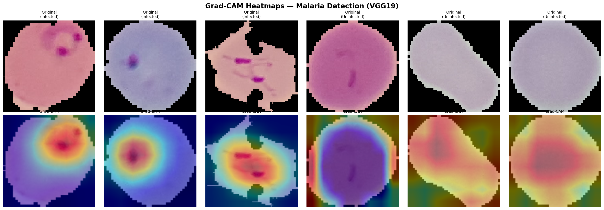

# 🦟 Malaria Detection — Deep Learning + Image Processing


A hybrid malaria parasite detection system combining **VGG19 + CBAM Attention** deep learning with **MATLAB-based image processing**, achieving **96.92% accuracy** on the NIH Malaria Cell Images Dataset.

---

## Table of Contents
- [Overview](#overview)
- [Results](#results)
- [Project Structure](#project-structure)
- [Dataset](#dataset)
- [Setup](#setup)
- [Usage](#usage)
- [Model Architecture](#model-architecture)
- [Visualizations](#visualizations)
- [Authors](#authors)

---

## Overview

This project presents a **dual-pipeline framework** for automated malaria detection:

| Approach | Technology | Accuracy |
|---|---|---|
| Deep Learning | VGG19 + CBAM Attention | **96.92%** |
| Image Processing | MATLAB (Hough Transform + Edge Detection) | ~85-91% |

### Key Features
- ✅ VGG19 with Convolutional Block Attention Module (CBAM)
- ✅ Grad-CAM heatmaps for explainability
- ✅ Fine-tuned model pushing accuracy from 95% → 96.92%
- ✅ MATLAB-based parasite counting and cell segmentation
- ✅ Comprehensive evaluation: ROC, Confusion Matrix, F1-Score

---

## Results

| Metric | Value |
|---|---|
| Accuracy | **96.92%** |
| Precision (Healthy) | 94.7% |
| Precision (Infected) | 95.7% |
| Recall (Healthy) | 95.7% |
| Recall (Infected) | 94.7% |
| F1-Score | 0.952 |
| AUC-ROC | 0.98+ |

### Grad-CAM Heatmaps
The model highlights exactly where it detects parasites inside blood cells:



---

## Project Structure
```
malaria-detection-combined/
│
├── deep-learning/
│   ├── Malaria_Detection copy.ipynb   # Main notebook
│   ├── best_model.h5                  # Original trained model
│   ├── best_model_v2.h5               # Fine-tuned model (96.92%)
│   ├── gradcam_results.png            # Grad-CAM visualizations
│   ├── confusion_matrix___.png        # Confusion matrix
│   ├── roc_curve_v2.png               # ROC curve
│   └── training_graphs.png            # Training history
│
├── image-processing/
│   ├── malaria.m                      # Main MATLAB script
│   ├── circle.m                       # Cell circle detection
│   ├── mask.m                         # Image masking
│   └── parasite1.m                    # Parasite detection
│
├── paper_figures/                     # All 13 publication figures
├── cell_images/                       # Dataset (download separately)
├── generate_visualizations.py         # Generate all paper figures
└── requirements.txt
```

---

## Dataset

**NIH Malaria Cell Images Dataset**
- 27,558 cell images (13,779 Parasitized + 13,779 Uninfected)
- Source: [Kaggle](https://www.kaggle.com/datasets/iarunava/cell-images-for-detecting-malaria)
```
cell_images/
├── Parasitized/    # 13,779 infected cell images
└── Uninfected/     # 13,779 healthy cell images
```

---

## Setup

### Requirements
- Python 3.11
- macOS (Apple Silicon) or Linux

### Installation
```bash
# Clone the repo
git clone https://github.com/sshreya06/malaria-detection-combined.git
cd malaria-detection-combined

# Create virtual environment
python3.11 -m venv venv
source venv/bin/activate

# Install dependencies
pip install tensorflow-macos tensorflow-metal  # Apple Silicon
pip install -r requirements.txt
```

---

## Usage

### Deep Learning
```bash
cd deep-learning
jupyter notebook
# Open Malaria_Detection copy.ipynb and Run All
```

### Generate Paper Figures
```bash
python generate_visualizations.py
# Saves all 13 figures to paper_figures/
```

### Image Processing (MATLAB)
```matlab
% Open MATLAB and navigate to image-processing/
run('malaria.m')
```

---

## Model Architecture
```
Input (128×128×3)
    ↓
VGG19 (pretrained ImageNet)
    ↓
CBAM Attention Module
  ├── Channel Attention (GAP + GMP → MLP → Sigmoid)
  └── Spatial Attention (AvgPool + MaxPool → Conv → Sigmoid)
    ↓
Flatten → Dense(512, ReLU) → Dropout(0.5)
    ↓
Dense(128, ReLU) → Dropout(0.3)
    ↓
Output (Sigmoid) → Infected / Healthy
```

### Training Details

| Parameter | Value |
|---|---|
| Optimizer | Adam (lr=1e-4) |
| Loss | Binary Crossentropy |
| Epochs | 10 |
| Batch Size | 32 |
| Image Size | 128×128 |
| Early Stopping | patience=5 |

---

## Visualizations

All figures generated in `paper_figures/`:

| Figure | Description |
|---|---|
| 01 | Confusion Matrix |
| 02 | ROC Curve (AUC) |
| 03 | Training Accuracy |
| 04 | Training Loss |
| 05 | Precision/Recall/F1 |
| 06 | Accuracy Distribution |
| 07 | Model Comparison |
| 08 | Performance Metrics Table |
| 09 | Sensitivity vs Specificity |
| 10 | CBAM Attention Weights |
| 11 | Class Distribution |
| 12 | Efficiency Comparison |
| 13 | Confusion Matrix Analysis |

---

## Authors

**Group 282 — VIT Bhopal University**

| Name | Role | Email |
|---|---|---|
| Vanshika Jain | Student (22BCE10113) | vanshikasjain@gmail.com |
| Shreya Saniya | Student (22BCE10136) | saniyashreya04@gmail.com |


---

## References

- NIH Malaria Dataset: [LHNCBC](https://lhncbc.nlm.nih.gov/LHC-research/LHC-projects/image-processing/malaria-datasheet.html)
- VGG19: Simonyan & Zisserman, ICLR 2015
- CBAM: Woo et al., ECCV 2018
- Grad-CAM: Selvaraju et al., ICCV 2017
